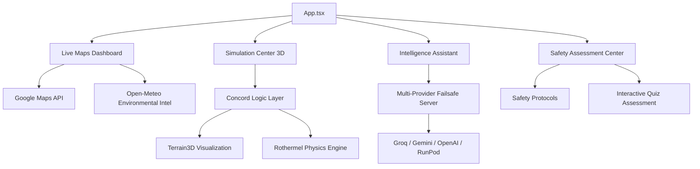

# System Architecture - SAFE (Simulated Analysis of Fire Ecology)

This document outlines the structural design and data flow of the SAFE platform.

## 🏗️ High-Level Overview

SAFE is built as a modular React application with a clear separation between the UI layer, the environmental data services, and the high-fidelity **Concord Simulation Engine**.

## 📁 Directory Structure

| Directory | Responsibility |
|-----------|----------------|
| `src/components` | UI components, R3F wrappers, and the Decisive Action assessment center. |
| `src/hooks` | Custom React hooks for simulation lifecycles and georeferenced data management. |
| `src/logic/concord` | **Core Engine**: Modular architecture for fire state management and topography mapping. |
| `src/services` | External API communication for atmospheric gradients and AI intelligence. |
| `src/utils` | Pure logic for geofencing, cellular automata, and coordinate transformations. |
| `server/` | Node.js backend managing the resilient multi-provider AI failsafe system. |

## 🧬 Intelligence Architecture

### 1. Multi-Provider Failsafe
The backend implements a "Chain of Responsibility" to ensure 100% uptime for safety queries:
1. **Groq (Llama 3.3 70B)**: Primary high-speed technical responder.
2. **Google Gemini (2.0 Flash)**: Secondary high-fidelity environmental reasoning.
3. **OpenAI / RunPod**: Tertiary and Quaternary infrastructure fallbacks.

### 2. Safety Assessment System
- **FAQProtocols.tsx**: Manages the decisive action documentation and the state-based assessment quiz.
- **Local Logic**: Instant responses for platform-specific queries using optimized pattern matching.

## 🔄 Concord Simulation Loop

### 1. Data Ingestion
- High-resolution environmental gradients (wind, temp, humidity) are fetched via Open-Meteo.
- Bilinear interpolation upsamples sparse meteorological data to a high-density simulation grid.

### 2. Physics Pipeline
The Concord Engine (`src/logic/concord`) executes a discrete time-stepping loop:
- **`get-fire-spread-rate.ts`**: Calculates physical spread (ft/min) based on wind vectors and topography.
- **`fire-engine.ts`**: Coordinates the BFS-based propagation and Bresenham line-of-sight checks for suppressants.

## 🛠️ Technology Stack
- **Frontend**: Vite + React, Three.js (React Three Fiber), Google Maps API.
- **Backend**: Node.js, Express, AI Provider SDKs.
- **Physics**: Rothermel Surface Fire Spread Model implementation.

---
*SAFE Architecture Documentation - Final Implementation (v4.0)*
