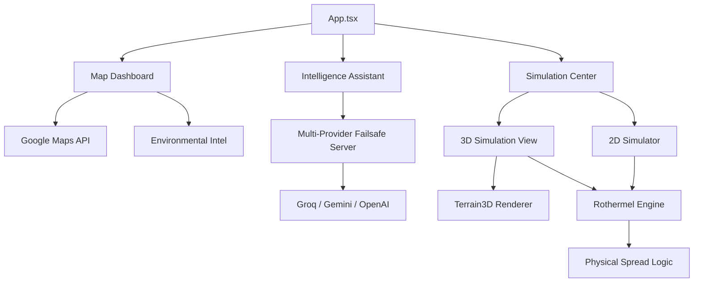

# System Architecture - SAFE

This document outlines the structural design and data flow of the SAFE (Smart Analytics for Fire Emergencies) platform.

## 🏗️ High-Level Overview

SAFE is built as a modular React application with a clear separation between the UI layer, the data services, and the high-fidelity mathematical simulation engine.

## 📁 Directory Structure

| Directory | Responsibility |
|-----------|----------------|
| `src/components` | UI components, including Three.js wrappers, dashboard elements, and the Intelligence Assistant. |
| `src/logic` | The "brain" of the app. Contains the Rothermel physics model and procedural terrain generation. |
| `src/services` | External API communication for wildfire data and environmental metrics. |
| `server/` | Node.js backend managing the multi-provider AI failsafe system and document intelligence. |

## 🧬 Intelligence Architecture

### 1. Hybrid Chatbot System
The Intelligence Assistant (`Chatbot.tsx`) utilizes a dual-layer logic:
- **Local Layer**: Instant response for core platform identity using word-boundary regex matching.
- **Cloud Layer**: Complex technical reasoning routed through a resilient backend.

### 2. Multi-Provider Failsafe
The backend (`server/index.ts`) implements a sequential failover chain to ensure 100% uptime:
1. **Groq (Llama 3)**: Primary high-speed technical responder.
2. **Google Gemini**: Secondary environmental reasoning.
3. **OpenAI**: Tertiary technical documentation analysis.
4. **Local Fallback**: Pre-indexed technical summary if all external APIs are throttled.

## 🔄 Simulation Data Flow

### 1. Environmental Intelligence
- On mount, `App.tsx` fetches environmental data (wind, temperature, moisture) via `wildfireApi.ts`.
- Data is cached in `LocalStorage` (1-hour TTL) to optimize performance.

### 2. High-Fidelity Physics Loop
- The simulation engine (`wildfireEngineAdapted.ts`) implements the **Rothermel Surface Fire Spread Model**.
- It calculates fire behavior based on:
    - **Fuel Properties**: SAV ratio, packing ratio, and moisture of extinction.
    - **Environmental Factors**: Wind vectors and topographic slope.
    - **Suppression Logic**: Real-time impact of Helitack drops and fireline construction.

## 🛠️ Technology Stack
- **Frontend**: Vite + React, Three.js (React Three Fiber), Framer Motion, Lucide Icons.
- **Backend**: Node.js, Express, LangChain, OpenAI/Gemini SDKs.
- **Mapping**: Google Maps JavaScript API.
- **Styling**: Vanilla CSS with modern glassmorphism and dynamic layout tokens.

---
*SAFE Architecture Documentation - v2.1 (Hackathon Ready)*
