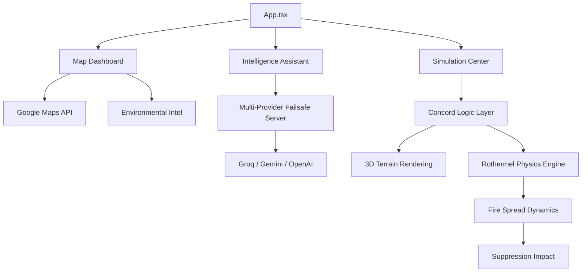

# System Architecture - SAFE

This document outlines the structural design and data flow of the SAFE (Smart Analytics for Fire Emergencies) platform.

## 🏗️ High-Level Overview

SAFE is built as a modular React application with a clear separation between the UI layer, the data services, and the high-fidelity **Concord Simulation Engine**.

## 📁 Directory Structure

| Directory | Responsibility |
|-----------|----------------|
| `src/components` | UI components, Three.js wrappers, dashboard elements, and the Intelligence Assistant. |
| `src/logic/concord` | **Core Engine**: Modular architecture for fire state management and topography mapping. |
| `src/logic/concord/engine` | **Physics Core**: Implementation of the Rothermel spread equations and propagation algorithms. |
| `src/services` | External API communication for wildfire data and environmental metrics. |
| `server/` | Node.js backend managing the multi-provider AI failsafe system and document intelligence. |

## 🧬 Intelligence Architecture

### 1. Hybrid Chatbot System
The Intelligence Assistant utilizes a dual-layer logic:
- **Local Layer**: Instant response for core platform identity using word-boundary regex matching.
- **Cloud Layer**: Complex technical reasoning routed through a resilient backend failsafe.

### 2. Multi-Provider Failsafe
The backend implements a sequential failover chain to ensure 100% uptime:
1. **Groq (Llama 3)**: Primary high-speed technical responder.
2. **Google Gemini**: Secondary environmental reasoning.
3. **OpenAI / Mistral**: Tertiary technical fallback.
4. **Local Fallback**: Pre-indexed technical summary if all external APIs are throttled.

## 🔄 Concord Simulation Loop

### 1. Environmental Data Acquisition
- Regional intelligence (wind, temperature, drought) is fetched via `wildfireApi.ts` and cached locally.
- Data is mapped to the **Concord Zone** model, defining regional vegetation and topography.

### 2. Modular Physics Pipeline
The Concord Engine (`src/logic/concord`) separates concerns for better scalability:
- **`cell.ts`**: Encapsulates the state and behavioral logic for individual grid units.
- **`fire-engine.ts`**: Coordinates the time-stepped cellular automata loop.
- **`get-fire-spread-rate.ts`**: The pure physics calculator for Rothermel spread rates.

## 🛠️ Technology Stack
- **Frontend**: Vite + React, Three.js (React Three Fiber), Framer Motion.
- **Backend**: Node.js, Express, LangChain, OpenAI/Gemini/Groq SDKs.
- **Mapping**: Google Maps JavaScript API.
- **Core Logic**: TypeScript-based Concord Engine.

---
*SAFE Architecture Documentation - Concord Engine Update (v3.0)*
