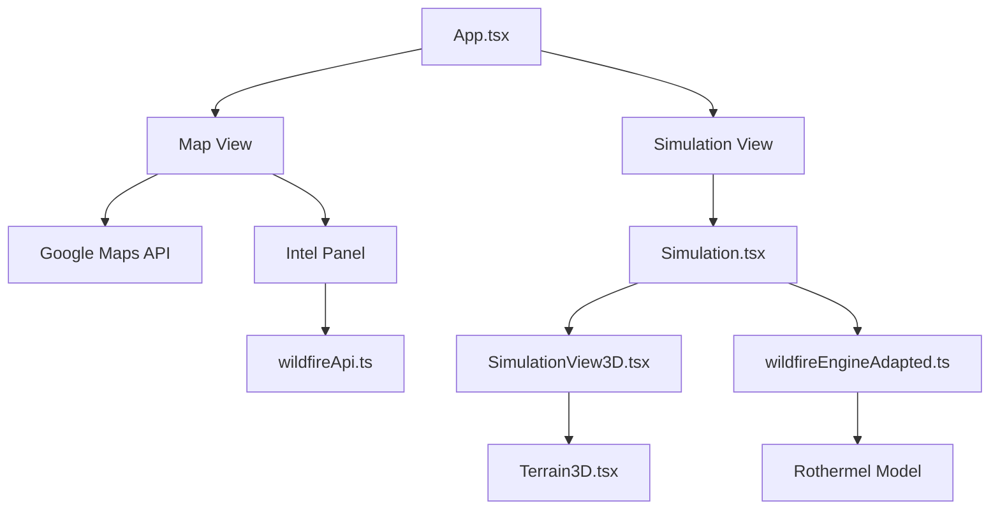

# System Architecture - SAFE

This document outlines the structural design and data flow of the SAFE platform.

## 🏗️ High-Level Overview

SAFE is built as a modular React application with a clear separation between the UI layer, the data services, and the mathematical simulation engine.

## 📁 Directory Structure

| Directory | Responsibility |
|-----------|----------------|
| `src/components` | UI components, including Three.js wrappers and dashboard elements. |
| `src/logic` | The "brain" of the app. Contains the physics models and grid state management. |
| `src/services` | External API communication (currently mocked/simulated for wildfire data). |
| `src/assets` | Global styles, images, and theme tokens. |

## 🧬 Component Hierarchy

1. **`App.tsx`**: Main controller. Manages navigation state (`MAP` vs `SIMULATION`) and top-level data fetching.
2. **`Simulation.tsx`**: The simulation coordinator. Handles the simulation loop (`requestAnimationFrame`) and passes the state to the 3D renderer.
3. **`SimulationView3D.tsx`**: The Three.js scene container. Sets up lighting, cameras, and controls.
4. **`Terrain3D.tsx`**: Renders the voxel-based or grid-based terrain using optimized Three.js instances.

## 🔄 Data Flow

### 1. Intelligence Data
- On mount, `App.tsx` fetches environmental data via `wildfireApi.ts`.
- Data is cached in `LocalStorage` to minimize API calls.
- State is passed down to the `IntelPanel` for visualization.

### 2. Simulation Loop
- When the user starts a simulation, `Simulation.tsx` initializes a grid based on environmental parameters (wind, drought, vegetation).
- A `useEffect` loop or `requestAnimationFrame` calls `stepSimulation` from the logic layer.
- `stepSimulation` returns a new grid state, which triggers a re-render of the 3D components.

## 🛠️ State Management
- **Local State**: Primarily handled via React `useState` and `useRef` for performance-critical 3D values.
- **Persistence**: `LocalStorage` is used for caching environmental metrics and user preferences.

## 📡 API Integration
- **Google Maps**: Used for spatial visualization of regional risks.
- **Custom Service**: `wildfireApi.ts` provides structured `WildfireData` including temperature, humidity, and road status.
